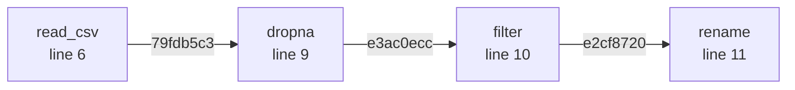

<div align="center">

# provtrack

**Zero-instrumentation ML pipeline provenance tracking.**

[](https://pypi.org/project/provtrack/)
[](https://pypi.org/project/provtrack/)
[](LICENSE)
[]()
[]()
[](https://pandas.pydata.org/)
[](https://scikit-learn.org/)

</div>

---

MLflow tracks your hyperparameters. It does not track what happened to your data between `pd.read_csv()` and `model.fit()`. That gap is where debugging takes hours. provtrack closes it.

Add one line to your script. Get a complete, cryptographically-linked DAG of every operation that touched your data, from the raw CSV all the way to the trained model. No decorators, no config files, no rewriting your pipeline.

```python
import provtrack
provtrack.activate()          # this is the one line

import pandas as pd

df = pd.read_csv("titanic.csv")
df = provtrack.wrap(df)
df = df.dropna(subset=["Age", "Embarked"])
df = df[df["Age"] > 18]
df = df.rename(columns={"Survived": "label"})

print(provtrack.lineage().summary())
```

```
Pipeline: 4 operations, 3 data-flow edges
Sequence: read_csv -> dropna -> filter -> rename

Operation breakdown:
  read_csv               1x   avg 0.0 ms
  dropna                 1x   avg 3.7 ms
  filter                 1x   avg 0.9 ms
  rename                 1x   avg 0.8 ms
```



The hashes on the edges are SHA-256 fingerprints of the DataFrame state at that point. If your data changes between runs, the hash changes. That is how you know something upstream broke your pipeline.

---

## The problem this solves

You trained a model six months ago. It worked. You retrain today and the AUC drops by 8 points. What changed?

You have git history for your code. You have MLflow for your hyperparameters. But you have nothing for the actual data transformations that happened between the raw file and the model input. Did someone add a `fillna` that used to be a `dropna`? Did the column filter threshold change? Did a new preprocessing step sneak in that was never in any commit message?

provtrack answers these questions without any manual logging. Every intermediate DataFrame state is fingerprinted. Every operation is recorded with the line number it came from. You can diff two pipeline runs and see exactly where the data diverged.

---

## Install

```bash
pip install provtrack
```

With sklearn support:

```bash
pip install provtrack[sklearn]
```

Requirements: Python 3.8+, pandas 1.3+, networkx 2.6+

---

## Quickstart

```python
import provtrack
provtrack.activate(verbose=True)

import pandas as pd
from sklearn.preprocessing import StandardScaler

# pandas I/O functions are auto-patched after activate()
df = pd.read_csv("data.csv")
df = provtrack.wrap(df)        # wrap if you loaded before activate()

# Every transformation is now tracked automatically
df = df.dropna()
df = df[df["age"] > 18]
df = df[["age", "income", "label"]]
df = df.rename(columns={"label": "y"})

# sklearn estimators need one explicit wrap
scaler = provtrack.wrap(StandardScaler())
X = scaler.fit_transform(df.drop("y", axis=1))

# Get the lineage
graph = provtrack.lineage()
print(graph.summary())

# Export to Mermaid (renders in GitHub, Notion, Obsidian)
print(graph.to_mermaid())

# Export to Graphviz DOT (pipe through dot -Tpng for an image)
print(graph.to_dot())

# Save session to disk for CLI queries later
import json
with open("session.json", "w") as f:
    f.write(graph.to_json())
```

---

## CLI

provtrack ships a CLI for querying saved sessions without writing Python.

```bash
# Human-readable pipeline report
provtrack report --file session.json

# Export the lineage graph
provtrack export --file session.json --format mermaid
provtrack export --file session.json --format dot --output pipeline.dot
provtrack export --file session.json --format json

# Find every operation that touched a specific data state
provtrack query --file session.json --hash e3ac0ecc

# Find all pandas operations
provtrack query --file session.json --tag pandas

# Find all sklearn operations
provtrack query --file session.json --tag sklearn

# Find every dropna in the pipeline
provtrack query --file session.json --op dropna

# Compare two pipeline runs -- find what changed
provtrack diff --a session_v1.json --b session_v2.json

# Verify the lineage graph is a valid DAG (no circular dependencies)
provtrack validate --file session.json
```

The diff command is the one you actually want when something breaks in production. It shows you which operations exist in one run but not the other, so you know exactly where the pipelines diverged.

---

## How it works

provtrack has four layers. Each one does exactly one job.

```
Your code
    |
    v
┌─────────────────────────────────────────────────────┐
│  Layer 4: activate.py                               │
│  Patches pd.read_csv, pd.read_parquet, etc.         │
│  Returns DataFrameProxy instead of DataFrame        │
└──────────────────────┬──────────────────────────────┘
                       |
                       v
┌─────────────────────────────────────────────────────┐
│  Layer 3: proxy.py                                  │
│  DataFrameProxy.__getattr__ intercepts every call   │
│  Calls the real method, re-wraps the result         │
│  Records (op_name, input_hash, output_hash, line)   │
└──────────────────────┬──────────────────────────────┘
                       |
                       v
┌─────────────────────────────────────────────────────┐
│  Layer 2: hasher.py + logger.py                     │
│  SHA-256 fingerprint of each DataFrame state        │
│  Immutable OperationRecord stored in thread-safe    │
│  singleton. Frozen dataclass -- cannot be mutated.  │
└──────────────────────┬──────────────────────────────┘
                       |
                       v
┌─────────────────────────────────────────────────────┐
│  Layer 1: graph.py                                  │
│  NetworkX DiGraph. Nodes = operations.              │
│  Edges = data flows, linked by hash identity.       │
│  output_hash(A) == input_hash(B) => edge A->B       │
└─────────────────────────────────────────────────────┘
```

### The proxy

`DataFrameProxy` is a transparent wrapper around `pd.DataFrame`. It uses `__slots__` to prevent attribute shadowing, `__class__` spoofing so `isinstance(proxy, pd.DataFrame)` returns True for sklearn compatibility, and `object.__getattribute__` for all internal access to avoid recursion.

When you call `df.dropna()` on a proxy:

1. `__getattr__("dropna")` fires and returns a wrapper function
2. The wrapper hashes the current DataFrame state (input hash)
3. The real `dropna()` runs on the underlying frame
4. The result is hashed (output hash)
5. An `OperationRecord` is logged with op name, both hashes, and your line number
6. The result is re-wrapped as a new `DataFrameProxy` so the next call is also tracked

This means `df.dropna().reset_index().rename(columns={"a": "b"})` generates three records with correctly linked hashes, with zero changes to your code.

### The hashing

Every DataFrame state is fingerprinted with `pd.util.hash_pandas_object`, which produces stable per-row uint64 hashes across processes and Python versions. The row hashes are collapsed to a single SHA-256 digest.

Python's built-in `hash()` is not used anywhere. It is randomised per process by `PYTHONHASHSEED` and cannot be compared across runs.

For DataFrames over 100,000 rows, provtrack hashes a seeded reservoir sample to bound latency to ~25ms regardless of file size.

### The graph

The graph links nodes by hash identity: if operation A's output hash equals operation B's input hash, then A produced the data that B consumed, so there is an edge from A to B. This works even if A and B are in different scripts, different sessions, or different processes, as long as the session JSON files are present.

Deduplication is applied at write time: if two calls produce the same `(op_name, input_hash, output_hash)` triple, only the first is kept. This prevents internal pandas operations from appearing as duplicate nodes.

---

## Comparison

| Tool | Approach | Tracks intermediate pandas ops | Zero instrumentation | Cross-run diff |
|------|----------|-------------------------------|---------------------|----------------|
| MLflow | Explicit logging | No | No | No |
| DVC | File-level hashing | No | No | Yes |
| mlinspect | AST rewriting | Partial | No (brittle) | No |
| Vamsa | Static analysis | No | No | No |
| DataLineagePy | Runtime proxy | Yes | No (explicit wrapping) | No |
| **provtrack** | **Runtime proxy** | **Yes** | **Yes** | **Yes** |

The key difference from DataLineagePy: provtrack's proxy is applied at the library level via `activate()`, not at the variable level. You do not need to wrap every assignment. You add one line at the top of your script and every DataFrame in the session is tracked.

---

## Performance

Overhead is bounded by the SHA-256 hash of the DataFrame after each operation. On an M2 MacBook Pro:

| DataFrame size | Hash time | Proxy overhead per call |
|----------------|-----------|------------------------|
| 1K rows x 10 cols | 0.3 ms | 0.01 ms |
| 10K rows x 10 cols | 2.1 ms | 0.01 ms |
| 100K rows x 10 cols | 25 ms | 0.01 ms |
| 1M+ rows | ~25 ms (sampled) | 0.01 ms |

For large DataFrames, provtrack samples 100,000 rows with a fixed seed before hashing. The sample is deterministic, so the same data always produces the same hash. The sampling threshold is configurable.

---

## Security

provtrack is designed for production use. These are not afterthoughts.

**Immutable records.** `OperationRecord` is a frozen dataclass. A record cannot be mutated after it is created. If you save a session to disk and the hashes change, the data changed.

**No raw data in logs.** Args and kwargs are stored as bounded repr strings, not raw objects. No user data leaks into the provenance record.

**No eval or exec anywhere.** The codebase has zero uses of `eval`, `exec`, or `__import__`. The CLI parses JSON with strict mode and validates file size before reading.

**Pickle blocked on proxies.** `DataFrameProxy.__reduce__` raises `TypeError`. You cannot accidentally pickle a proxy and bypass the underlying frame. Call `proxy.unwrap()` before pickling.

**Thread-safe logger.** All record mutations go through a `threading.Lock`. Safe for multi-threaded preprocessing pipelines.

**Reversible activation.** `provtrack.deactivate()` fully restores all original pandas callables from the stored patch table. Activation is idempotent -- calling `activate()` twice is safe.

---

## API reference

```python
# Activation
provtrack.activate(patch_sklearn=True, patch_pandas_readers=True, verbose=False)
provtrack.deactivate()
provtrack.reset()          # clear all records, keep activation
provtrack.is_active()      # bool

# Wrapping
provtrack.wrap(df)         # pd.DataFrame -> DataFrameProxy
provtrack.wrap(estimator)  # sklearn estimator -> EstimatorProxy

# Querying
graph = provtrack.lineage()
records = provtrack.records()

# Graph methods
graph.summary()
graph.to_mermaid()
graph.to_dot()
graph.to_json()
graph.nodes()
graph.roots()
graph.leaves()
graph.ancestors_of(op_id)
graph.descendants_of(op_id)
graph.path_between(src_op_id, dst_op_id)
graph.ops_by_name("dropna")
graph.ops_touching_data(hash)
graph.is_valid_dag()
```

---

## Project structure

```
provtrack/
├── provtrack/
│   ├── __init__.py     public API
│   ├── hasher.py       SHA-256 fingerprinting of DataFrame states
│   ├── logger.py       immutable OperationRecord + thread-safe singleton
│   ├── graph.py        NetworkX DAG: nodes = ops, edges = data flows
│   ├── proxy.py        DataFrameProxy + EstimatorProxy
│   ├── activate.py     patches pandas I/O functions, public API entry point
│   └── cli.py          report / export / query / diff / validate
├── tests/
│   ├── test_hasher.py  28 tests -- all edge cases for hashing
│   ├── test_proxy.py   17 tests -- interception, chaining, inplace, pickle block
│   └── test_graph.py   17 tests -- construction, querying, export formats
├── INTERNALS.md        every design decision explained
├── EDGE_CASES.md       15 documented edge cases with fixes and test references
└── setup.py
```

---

## Contributing

Read `INTERNALS.md` first. It explains every design decision and why it was made that way. The edge cases document covers 15 specific failure modes that were found and fixed during development.

```bash
git clone https://github.com/Princess0407/provtrack
cd provtrack
python -m venv venv && source venv/bin/activate
pip install -e ".[dev]"
pytest tests/ -v
```

All 64 tests should pass. If you are adding a new feature, add a test first. If you are fixing a bug, add the bug to EDGE_CASES.md with the fix and a test reference.

---

## Roadmap

**v1 (current):** pandas DataFrameProxy, sklearn EstimatorProxy, NetworkX DAG, CLI, session JSON export, Mermaid/DOT/JSON export formats.

**v2:** `sys.monitoring` (PEP 669, Python 3.12+) as the tracing layer instead of `__getattr__` proxy. Truly zero-instrumentation with no variable reassignment needed at all. PySpark DataFrame support. Pluggable storage backends (SQLite, S3). OpenLineage export format.

**v3:** Web UI for interactive DAG exploration. Team-scale graph database backing. Cryptographic signatures on records for tamper detection.

---

## License

Apache 2.0. See [LICENSE](LICENSE).

Built by [Princess](https://github.com/Princess0407).
